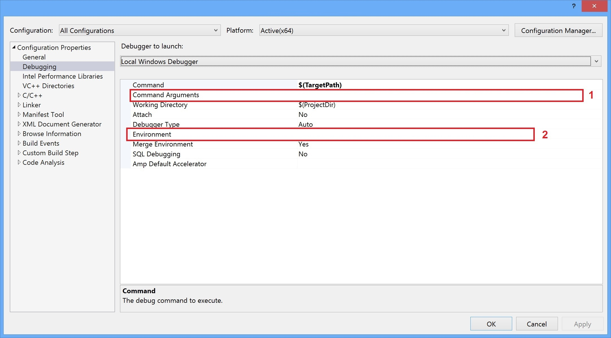

- [Dependencies](#dependencies)
  - [Debugging missing dependencies](#dependencies-debugging)
- [GPGPU acceleration](#gpu-acceleration)
- [Pre-built binaries](#prebuilt)
- [Building](#building)
  - [Windows](#building-windows)
  - [Generic GCC](#building-generic-gcc)
  - [Raspberry Pi (Raspbian OS)](#building-rpi)
- [Testing](#testing)
  - [Usage](#testing-usage)
  - [Examples](#testing-examples)


This application is used as reference code for developers to show how to use the [C++ API](https://www.doubango.org/SDKs/anpr/docs/cpp-api.html) and could
be used to easily check the accuracy. The application accepts path to a JPEG/PNG/BMP file as input. This **is not the recommended** way to use the API. We recommend reading the data directly from the camera and feeding the SDK with the uncompressed **YUV data** without saving it to a file or converting it to RGB.

If you don't want to build this sample and is looking for a quick way to check the accuracy then, try
our cloud-based solution at [https://www.doubango.org/webapps/alpr/](https://www.doubango.org/webapps/alpr/).

This sample is open source and doesn't require registration or license key.

<a name="dependencies"></a>
# Dependencies #
**The SDK is developed in C++11** and you'll need **glibc 2.27+** on *Linux* and **[Visual C++ Redistributable for Visual Studio 2015](https://www.microsoft.com/en-us/download/details.aspx?id=48145)** (any later version is ok) on *Windows*.  **You most likely already have these dependencies on you machine** as almost every program require it.

If you're planning to use [OpenVINO](https://docs.openvinotoolkit.org/), then you'll need [Intel C++ Compiler Redistributable](https://software.intel.com/en-us/articles/intel-compilers-redistributable-libraries-by-version) (choose newest). Please note that OpenVINO is packaged in the SDK as plugin and loaded (`dlopen`) at runtime. The engine will fail to load the plugin if [Intel C++ Compiler Redistributable](https://software.intel.com/en-us/articles/intel-compilers-redistributable-libraries-by-version) is missing on your machine **but the program will work as expected** with Tensorflow as fallback. We highly recommend using [OpenVINO](https://docs.openvinotoolkit.org/) to speedup the inference time. See benchmark numbers with/without [OpenVINO](https://docs.openvinotoolkit.org/) at https://www.doubango.org/SDKs/anpr/docs/Benchmark.html#core-i7-windows.

<a name="dependencies-debugging"></a>
## Debugging missing dependencies ##
To check if all dependencies are present:
- **Windows x86_64:** Use [Dependency Walker](https://www.dependencywalker.com/) on [binaries/windows/x86_64/ultimateALPR-SDK.dll](../../../binaries/windows/x86_64/ultimateALPR-SDK.dll) and [binaries/windows/x86_64/ultimatePluginOpenVINO.dll](../../../binaries/windows/x86_64/ultimatePluginOpenVINO.dll) if you're planning to use [OpenVINO](https://docs.openvinotoolkit.org/).
- **Linux x86_64:** Use `ldd <your-shared-lib>` on [binaries/linux/x86_64/libultimate_alpr-sdk.so](../../../binaries/linux/x86_64/libultimate_alpr-sdk.so) and [binaries/linux/x86_64/libultimatePluginOpenVINO.so](../../../binaries/linux/x86_64/libultimatePluginOpenVINO.so) if you're planning to use [OpenVINO](https://docs.openvinotoolkit.org/).

<a name="gpu-acceleration"></a>
# GPGPU acceleration #
By default GPGPU acceleration is disabled. Check [here](../README.md#gpu-acceleration) for more information on how to enable it.

<a name="prebuilt"></a>
# Pre-built binaries #

If you don't want to build this sample by yourself then, use the pre-built C++ versions:
 - Windows x86_64: [recognizer.exe](../../../binaries/windows/x86_64/recognizer.exe) under [binaries/windows/x86_64](../../../binaries/windows/x86_64)
 - Linux x86_64: [recognizer](../../../binaries/linux/x86_64/recognizer) under [binaries/linux/x86_64](../../../binaries/linux/x86_64). Built on Ubuntu 18. **You'll need to download libtensorflow.so as explained [here](../README.md#gpu-acceleration-tensorflow-linux)**.
 - Linux aarch64: [recognizer](../../../binaries/linux/aarch64/recognizer) under [binaries/linux/aarch64](../../../binaries/linux/aarch64).
 - Raspberry Pi: [recognizer](../../../binaries/raspbian/armv7l/recognizer) under [binaries/raspbian/armv7l](../../../binaries/raspbian/armv7l)
 - Android: check [android](../../android) folder
 
On **Windows**, the easiest way to try this sample is to navigate to [binaries/windows/x86_64](../../../binaries/windows/x86_64/) and run [binaries/windows/x86_64/recognizer.bat](../../../binaries/windows/x86_64/recognizer.bat). You can edit these files to use your own images and configuration options.

<a name="building"></a>
# Building #

This sample contains [a single C++ source file](recognizer.cxx) and is easy to build. The documentation about the C++ API is at [https://www.doubango.org/SDKs/anpr/docs/cpp-api.html](https://www.doubango.org/SDKs/anpr/docs/cpp-api.html).

<a name="building-windows"></a>
## Windows ##
You'll need Visual Studio to build the code. The VS project is at [recognizer.vcxproj](recognizer.vcxproj). Open it.
 1. You will need to change the **"Command Arguments"** like the [below image](../../../VC++_config.jpg). Default value: `--image $(ProjectDir)..\..\..\assets\images\lic_us_1280x720.jpg --charset latin --assets $(ProjectDir)..\..\..\assets`
 2. You will need to change the **"Environment"** variable like the [below image](../../../VC++_config.jpg). Default value: `PATH=$(VCRedistPaths)%PATH%;$(ProjectDir)..\..\..\binaries\windows\x86_64`
 

 
You're now ready to build and run the sample.

<a name="building-generic-gcc"></a>
## Generic GCC ##
Next command is a generic GCC command:
```
cd ultimateALPR-SDK/samples/c++/recognizer

g++ recognizer.cxx -O3 -I../../../c++ -L../../../binaries/<yourOS>/<yourArch> -lultimate_alpr-sdk -o recognizer
```
- You've to change `yourOS` and  `yourArch` with the correct values. For example, on **Linux x86_64** they would be equal to `linux` and `x86_64` respectively.
- If you're cross compiling then, you'll have to change `g++` with the correct triplet. For example, on Linux host for Android ARM64 target the triplet would be equal to `aarch64-linux-android-g++`.

<a name="building-rpi"></a>
## Raspberry Pi (Raspbian OS) ##

To build the sample for Raspberry Pi you can either do it on the device itself or cross compile it on [Windows](../#cross-compilation-rpi-install-windows), [Linux](../#cross-compilation-rpi-install-ubuntu) or OSX machines. 
For more information on how to install the toolchain for cross compilation please check [here](../README.md#cross-compilation-rpi).

```
cd ultimateALPR-SDK/samples/c++/recognizer

arm-linux-gnueabihf-g++ recognizer.cxx -O3 -I../../../c++ -L../../../binaries/raspbian/armv7l -lultimate_alpr-sdk -o recognizer
```
- On Windows: replace `arm-linux-gnueabihf-g++` with `arm-linux-gnueabihf-g++.exe`
- If you're building on the device itself: replace `arm-linux-gnueabihf-g++` with `g++` to use the default GCC

<a name="testing"></a>
# Testing #
After [building](#building) the application you can test it on your local machine.

<a name="testing-usage"></a>
## Usage ##

recognizer is a command line application with the following usage:
```
recognizer \
      --image <path-to-image-with-to-process> \
      [--assets <path-to-assets-folder>] \
      [--parallel <whether-to-enable-parallel-mode:true/false>] \
      [--rectify <whether-to-enable-rectification-layer:true/false>] \
      [--charset <recognition-charset:latin/korean/chinese>] \
      [--openvino_enabled <whether-to-enable-OpenVINO:true/false>] \
      [--openvino_device <openvino-device-to-use>] \
      [--klass_lpci_enabled <whether-to-enable-LPCI:true/false>] \
      [--klass_vcr_enabled <whether-to-enable-VCR:true/false>] \
      [--klass_vmmr_enabled <whether-to-enable-VMMR:true/false>] \
      [--tokenfile <path-to-license-token-file>] \
      [--tokendata <base64-license-token-data>]
```
Options surrounded with **[]** are optional.
- `--image` Path to the image(JPEG/PNG/BMP) to process. You can use default image at [../../../assets/images/lic_us_1280x720.jpg](../../../assets/images/lic_us_1280x720.jpg).
- `--assets` Path to the [assets](../../../assets) folder containing the configuration files and models. Default value is the current folder.
- `--charset` Defines the recognition charset (a.k.a alphabet) value (latin, korean, chinese...). Default: *latin*.
- `--parallel` Whether to enabled the parallel mode. More info about the parallel mode at [https://www.doubango.org/SDKs/anpr/docs/Parallel_versus_sequential_processing.html](https://www.doubango.org/SDKs/anpr/docs/Parallel_versus_sequential_processing.html). Default: *false*.
- `--rectify` Whether to enable the rectification layer. More info about the rectification layer at [https://www.doubango.org/SDKs/anpr/docs/Rectification_layer.html](https://www.doubango.org/SDKs/anpr/docs/Rectification_layer.html). Always enabled on x86_64 CPUs. Default: *false*.
- `--openvino_enabled` Whether to enable OpenVINO. Tensorflow will be used when OpenVINO is disabled. Default: *true*.
- `--openvino_device` Defines the OpenVINO device to use (CPU, GPU, FPGA...). More info at https://www.doubango.org/SDKs/anpr/docs/Configuration_options.html#openvino-device. Default: *CPU*."
- `--klass_lpci_enabled` Whether to enable License Plate Country Identification (LPCI). More info at https://www.doubango.org/SDKs/anpr/docs/Features.html#license-plate-country-identification-lpci. Default: *false*.
- `--klass_vcr_enabled` Whether to enable Vehicle Color Recognition (VCR). More info at https://www.doubango.org/SDKs/anpr/docs/Features.html#vehicle-color-recognition-vcr. Default: *false*.
- `--klass_vmmr_enabled` Whether to enable Vehicle Make Model Recognition (VMMR). More info at https://www.doubango.org/SDKs/anpr/docs/Features.html#vehicle-make-model-recognition-vmmr. Default: *false*.
- `--tokenfile` Path to the file containing the base64 license token if you have one. If not provided then, the application will act like a trial version. Default: *null*.
- `--tokendata` Base64 license token if you have one. If not provided then, the application will act like a trial version. Default: *null*.

<a name="testing-examples"></a>
## Examples ##

For example, on **Raspberry Pi** you may call the recognizer application using the following command:
```
LD_LIBRARY_PATH=../../../binaries/raspbian/armv7l:$LD_LIBRARY_PATH ./recognizer \
    --image ../../../assets/images/lic_us_1280x720.jpg \
    --assets ../../../assets \
    --charset latin \
    --parallel false \
    --rectify false
```
On **Linux x86_64**, you may use the next command:
```
LD_LIBRARY_PATH=../../../binaries/linux/x86_64:$LD_LIBRARY_PATH ./recognizer \
    --image ../../../assets/images/lic_us_1280x720.jpg \
    --assets ../../../assets \
    --charset latin \
    --parallel false
```
On **Linux aarch64**, you may use the next command:
```
LD_LIBRARY_PATH=../../../binaries/linux/aarch64:$LD_LIBRARY_PATH ./recognizer \
    --image ../../../assets/images/lic_us_1280x720.jpg \
    --assets ../../../assets \
    --charset latin \
    --parallel false
```
On **Windows x86_64**, you may use the next command:
```
recognizer.exe ^
    --image ../../../assets/images/lic_us_1280x720.jpg ^
    --assets ../../../assets ^
    --charset latin ^
    --parallel false
```

Please note that if you're cross compiling the application then you've to make sure to copy the application and both the [assets](../../../assets) and [binaries](../../../binaries) folders to the target device.


