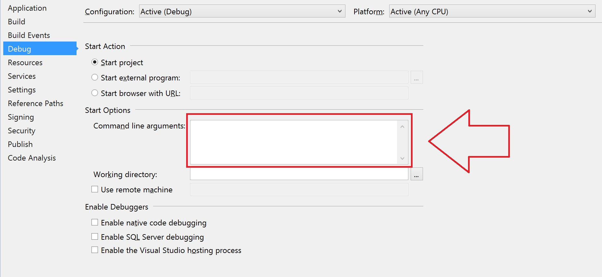

- [Dependencies](#dependencies)
  - [Debugging missing dependencies](#dependencies-debugging)
- [GPGPU acceleration](#gpu-acceleration)
- [Pre-built binaries](#prebuilt)
- [Building](#building)
- [Testing](#testing)
  - [Usage](#testing-usage)
  - [Examples](#testing-examples)


This application is a reference implementation for developers to show how to use the C# API and could
be used to easily check the accuracy. The C# API is a wrapper around the C++ API defined at [https://www.doubango.org/SDKs/anpr/docs/cpp-api.html](https://www.doubango.org/SDKs/anpr/docs/cpp-api.html). A C++ twin sample application is at [c++/recognizer](../../c++/recognizer).

The application accepts path to a JPEG/PNG/BMP file as input. This **is not the recommended** way to use the API. We recommend reading the data directly from the camera and feeding the SDK with the uncompressed **YUV data** without saving it to a file or converting it to RGB.

If you don't want to build this sample and is looking for a quick way to check the accuracy then, try
our cloud-based solution at [https://www.doubango.org/webapps/alpr/](https://www.doubango.org/webapps/alpr/).

This sample is open source and doesn't require registration or license key.

<a name="dependencies"></a>
# Dependencies #
**The SDK is developed in C++11** and you'll need **glibc 2.27+** on *Linux* and **[Visual C++ Redistributable for Visual Studio 2015](https://www.microsoft.com/en-us/download/details.aspx?id=48145)** (any later version is ok) on *Windows*.  **You most likely already have these dependencies on you machine** as almost every program require it.

If you're planning to use [OpenVINO](https://docs.openvinotoolkit.org/), then you'll need [Intel C++ Compiler Redistributable](https://software.intel.com/en-us/articles/intel-compilers-redistributable-libraries-by-version) (choose newest). Please note that OpenVINO is packaged in the SDK as plugin and loaded (`dlopen`) at runtime. The engine will fail to load the plugin if [Intel C++ Compiler Redistributable](https://software.intel.com/en-us/articles/intel-compilers-redistributable-libraries-by-version) is missing on your machine **but the program will work as expected** with Tensorflow as fallback. We highly recommend using [OpenVINO](https://docs.openvinotoolkit.org/) to speedup the inference time. See benchmark numbers with/without [OpenVINO](https://docs.openvinotoolkit.org/) at https://www.doubango.org/SDKs/anpr/docs/Benchmark.html#core-i7-windows.

<a name="dependencies-debugging"></a>
## Debugging missing dependencies ##
To check if all dependencies are present:
- **Windows x86_64:** Use [Dependency Walker](https://www.dependencywalker.com/) on [binaries/windows/x86_64/ultimateALPR-SDK.dll](../../../binaries/windows/x86_64/ultimateALPR-SDK.dll) and [binaries/windows/x86_64/ultimatePluginOpenVINO.dll](../../../binaries/windows/x86_64/ultimatePluginOpenVINO.dll) if you're planning to use [OpenVINO](https://docs.openvinotoolkit.org/).
- **Linux x86_64:** Use `ldd <your-shared-lib>` on [binaries/linux/x86_64/libultimate_alpr-sdk.so](../../../binaries/linux/x86_64/libultimate_alpr-sdk.so) and [binaries/linux/x86_64/libultimatePluginOpenVINO.so](../../../binaries/linux/x86_64/libultimatePluginOpenVINO.so) if you're planning to use [OpenVINO](https://docs.openvinotoolkit.org/).

<a name="gpu-acceleration"></a>
# GPGPU acceleration #
By default GPGPU acceleration is disabled. Check [here](../README.md#gpu-acceleration) for more information on how to enable it.

<a name="prebuilt"></a>
# Pre-built binaries #

If you don't want to build this sample by yourself then, use the pre-built C++ versions:
 - Windows x86_64: [recognizer.exe](../../../binaries/windows/x86_64/recognizer.exe) under [binaries/windows/x86_64](../../../binaries/windows/x86_64)
 - Linux x86_64: [recognizer](../../../binaries/linux/x86_64/recognizer) under [binaries/linux/x86_64](../../../binaries/linux/x86_64). Built on Ubuntu 18. **You'll need to download libtensorflow.so as explained [here](../README.md#gpu-acceleration-tensorflow-linux)**.
 - Linux aarch64: [recognizer](../../../binaries/linux/aarch64/recognizer) under [binaries/linux/aarch64](../../../binaries/linux/aarch64).
 - Raspberry Pi: [recognizer](../../../binaries/raspbian/armv7l/recognizer) under [binaries/raspbian/armv7l](../../../binaries/raspbian/armv7l)
 - Android: check [android](../../android) folder
 
On **Windows**, the easiest way to try this sample is to navigate to [binaries/windows/x86_64](../../../binaries/windows/x86_64/) and run [binaries/windows/x86_64/recognizer.bat](../../../binaries/windows/x86_64/recognizer.bat). You can edit these files to use your own images and configuration options.

<a name="building"></a>
# Building #

This sample contains [a single C# source file](Program.cs).

You'll need Visual Studio to build the code. The VS project is at [recognizer.vcxproj](recognizer.vcxproj). Open it.
 - You will need to change the **"Command line arguments"** like the [below image](../../../VC#_config.jpg). Default value: `--assets "$(ProjectDir)..\..\..\assets" --image "$(ProjectDir)..\..\..\assets\images\lic_us_1280x720.jpg" --charset "latin"`
 

 
You're now ready to build and run the sample.

<a name="testing-usage"></a>
## Usage ##

`recognizer` is a command line application with the following usage:
```
recognizer \
      --image <path-to-image-with-mrzdata-to-process> \
      [--assets <path-to-assets-folder>] \
      [--charset <recognition-charset:latin/korean/chinese>] \
      [--tokenfile <path-to-license-token-file>] \
      [--tokendata <base64-license-token-data>]
```
Options surrounded with **[]** are optional.
- `--image` Path to the image(JPEG/PNG/BMP) to process. You can use default image at [../../../assets/images/lic_us_1280x720.jpg](../../../assets/images/lic_us_1280x720.jpg).
- `--assets` Path to the [assets](../../../assets) folder containing the configuration files and models. Default value is the current folder.
- `--charset` Defines the recognition charset (a.k.a alphabet) value (latin, korean, chinese...). Default: *latin*.
- `--tokenfile` Path to the file containing the base64 license token if you have one. If not provided then, the application will act like a trial version. Default: *null*.
- `--tokendata` Base64 license token if you have one. If not provided then, the application will act like a trial version. Default: *null*.

<a name="testing-examples"></a>
## Examples ##
You'll need to change the Visual Studio properties to define the command line arguments.

```
recognizer.exe \
    --image "$(ProjectDir)..\..\..\assets\images\lic_us_1280x720.jpg" \
    --assets "$(ProjectDir)..\..\..\assets" \
    --charset "latin"
```


